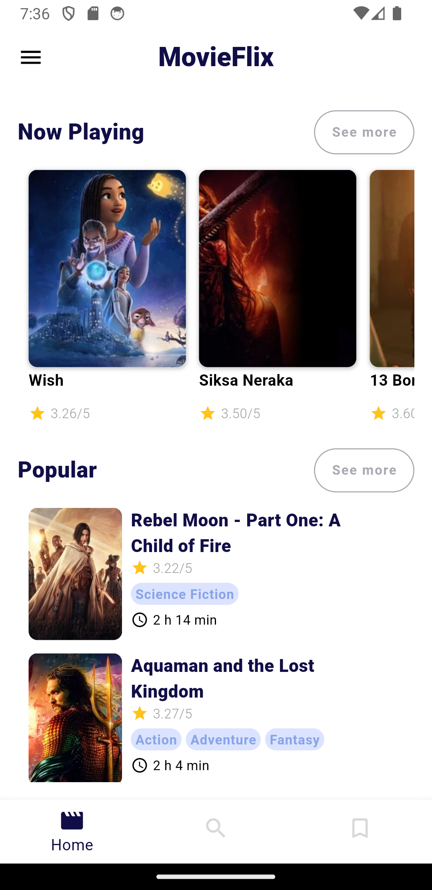
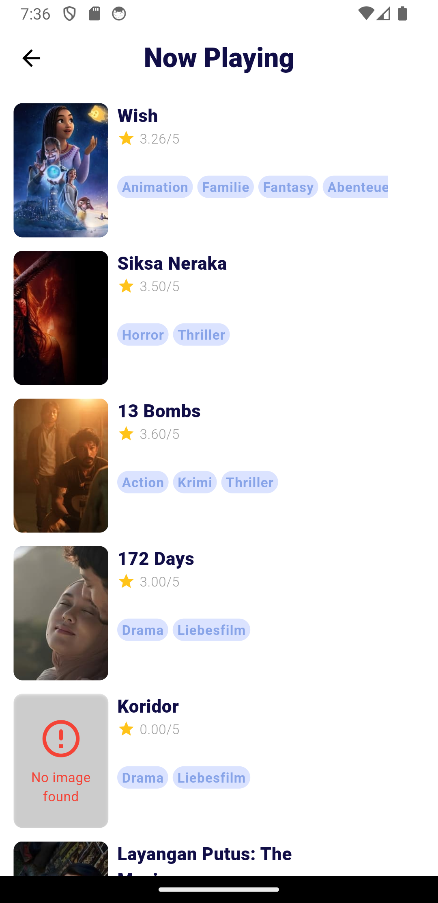
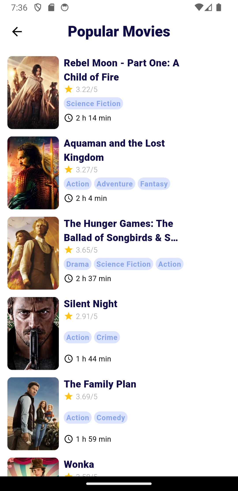
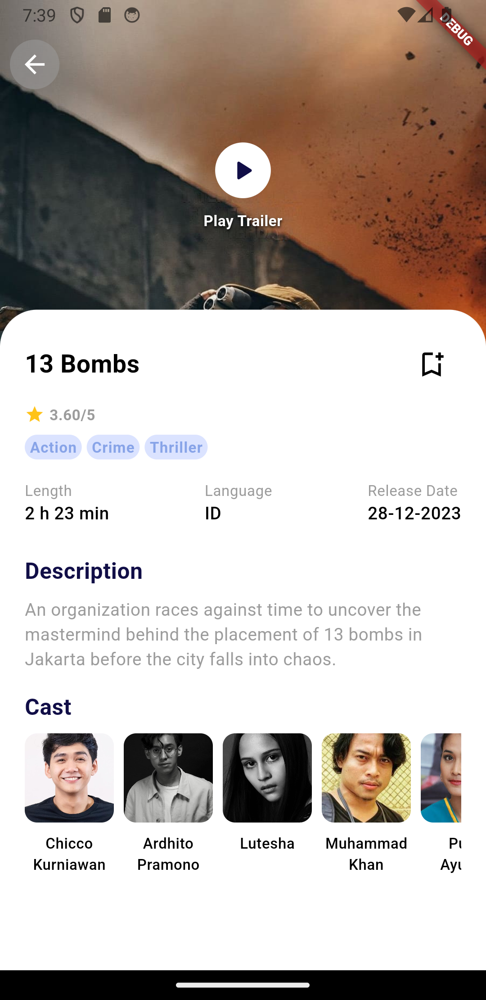
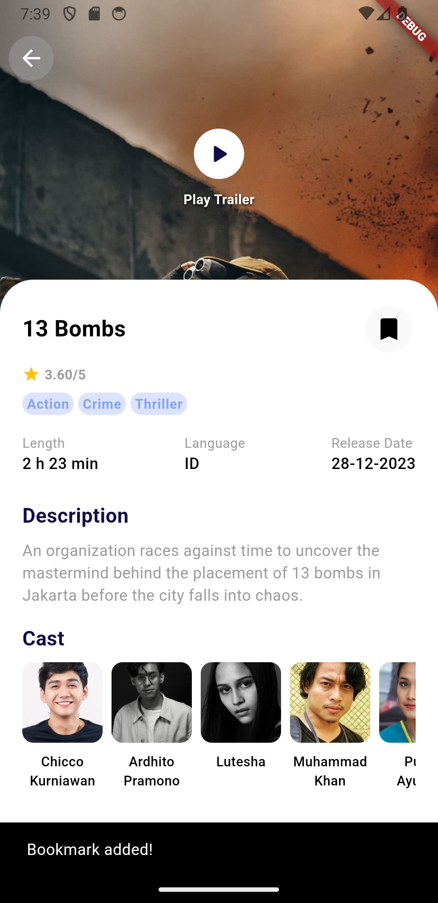
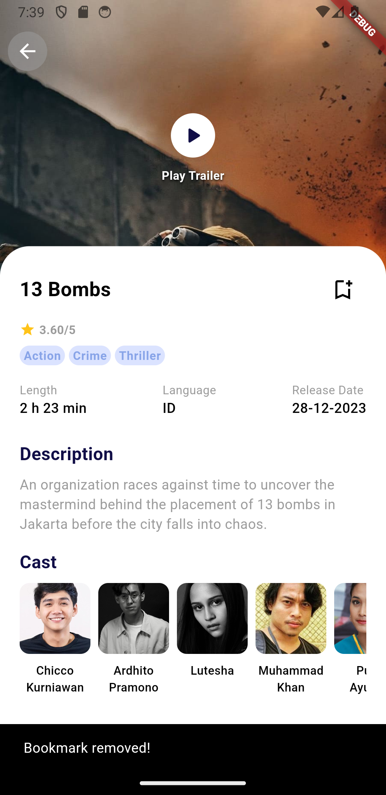
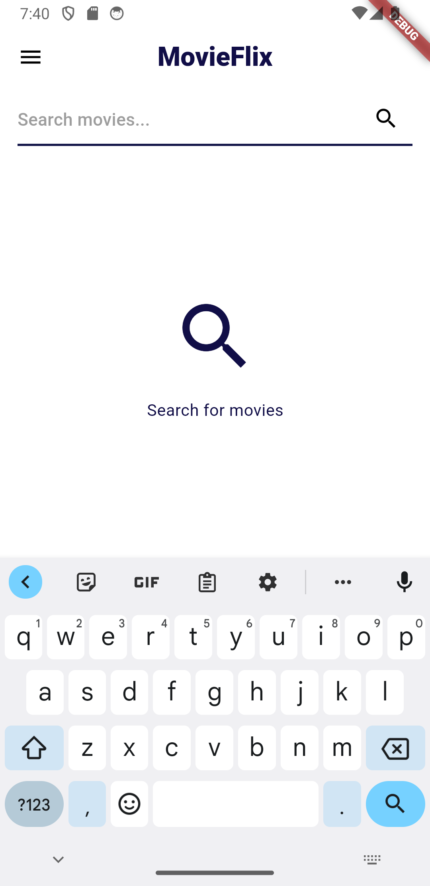
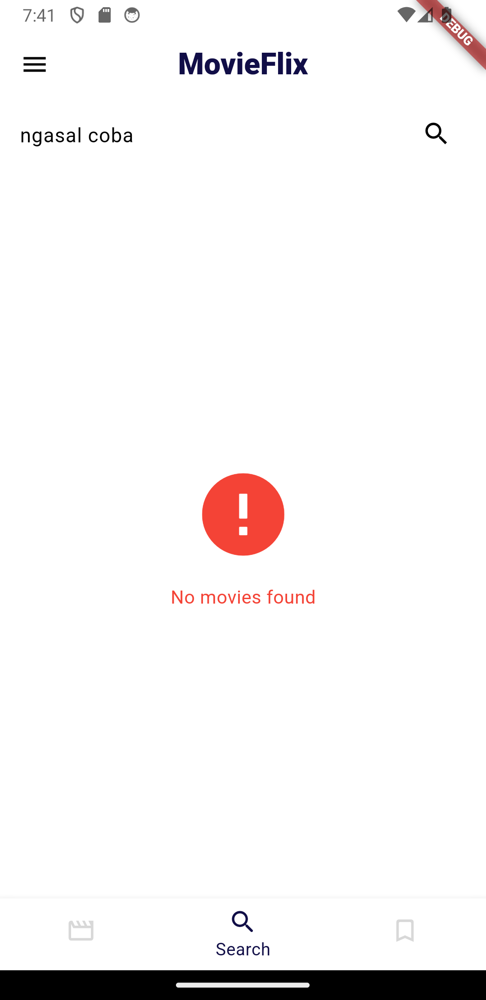
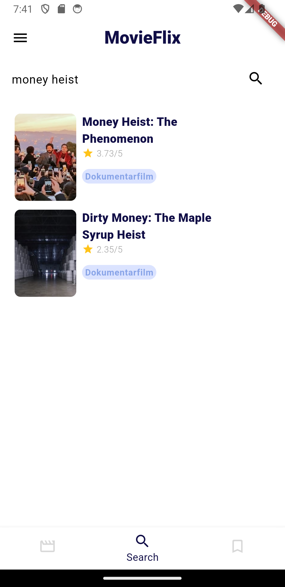
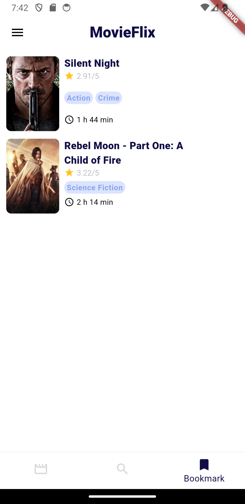

# MovieFlix

MovieFlix is a movie app that allows users to discover movies. The app displays a list of movies that are currently playing in theaters. Users can view movie details such as ratings, descriptions, cast members, trailers, and many others. Users can also search for movies by title. The app uses the Movie Database API to retrieve movie data.

## Screenshots

<table>
  <tr>
    <td>Home</td>
     <td>Now Playing</td>
     <td>Popular Movies</td>
  </tr>
  <tr>
    <td></td>
    <td></td>
    <td></td>
  </tr>
  <tr>
     <td>Movie Details</td>
     <td>Movie Trailer</td>
     <td>Search</td>
  </tr>
  <tr>
    <td></td>
    <td></td>
    <td></td>
  </tr>
  <tr>
     <td colspan=3>Bookmark</td>
  </tr>
  <tr>
    <td></td>
  </tr>
 </table>

 ## API

  The app uses the [Movie Database API](https://developers.themoviedb.org/3/getting-started/introduction) to retrieve movie data.

  ### MovieFlix API
  
  #### Base URL

  ```
  https://movieflix-api-seven.vercel.app/api
  ```

  #### Endpoints

  ```
  GET /now_playing

  query parameters:
    - page: number (optional) - page number (default: 1)
    - full: boolean (optional) - if true, returns full movie details data (default: false)
  ```

  ```
  GET /popular

  query parameters:
    - page: number (optional) - page number (default: 1)

  ```

  ```
  GET /movie/:id

  path parameters:
    - id: number (required) - movie id
  ```

  ```
  GET /search

  query parameters:
    - query: string (required)
    - page: number (optional)
  ```
  
  ### Example

  ```dart
  import 'package:http/http.dart' as http;
  import 'dart:convert' as convert;

  final baseUrl = 'https://movieflix-api-seven.vercel.app/api';

  Future<Map<String, dynamic>> getNowPlayingMovies({int page = 1, bool full = false}) async {
    final url = '$baseUrl/now_playing?page=$page&full=$full';
    final response = await http.get(url);
    final json = convert.jsonDecode(response.body);
    return json;
  }

  Future<Map<String, dynamic>> getPopularMovies({int page = 1}) async {
    final url = '$baseUrl/popular?page=$page';
    final response = await http.get(url);
    final json = convert.jsonDecode(response.body);
    return json;
  }

  Future<Map<String, dynamic>> getMovieDetails(int id) async {
    final url = '$baseUrl/movie/$id';
    final response = await http.get(url);
    final json = convert.jsonDecode(response.body);
    return json;
  }

  Future<Map<String, dynamic>> searchMovies(String query, {int page = 1}) async {
    final url = '$baseUrl/search?query=$query&page=$page';
    final response = await http.get(url);
    final json = convert.jsonDecode(response.body);
    return json;
  }
  ```

